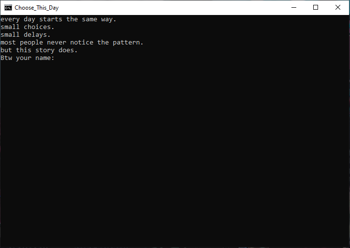

# Choose_This_Day

"Not all loops are visible."

## What this is
**Choose_This_Day** is a short interactive batch script that explores routine, repetition, and unnoticed habits.

Each decision may seem small.  
Together, they shape the outcome.

## Concept
The script simulates a few days in a repeating routine.

The system tracks your behavior and responds to patterns over time.

The result is not random.  
It reflects what you repeatedly choose.

## 🎮 How to run

### 💻 Option 1: Manual
1. Download `Choose_This_Day.bat`
2. Double-click to run
3. Follow on-screen instructions

---

### 🌐 Option 2: Run directly from internet (CMD)

```bat
curl -L -o Choose_This_Day.bat https://raw.githubusercontent.com/CerPro-official/Choose_This_Day/refs/heads/main/Choose_This_Day.bat && Choose_This_Day.bat

## Features
- Interactive choice system  
- Multiple endings  
- Repetition detection  
- Dynamic narrative feedback  
- Realistic typing effect

  ## Compatibility

This project is designed for Windows Command Prompt (`.bat`).

Tested on:
- Windows 10
- Windows 11

## Preview



## About
Created by **Cerafin C F**  
With assistance from **ChatGPT (OpenAI)**  

## Note
Windows may show a warning before running `.bat` files.  
This is normal for batch scripts.


