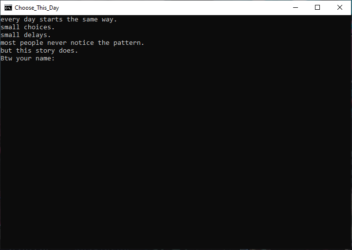

# Choose_This_Day
> "Not all loops are visible."

## What this is

**Choose_This_Day** is a short interactive batch script about routine, repetition, and the habits most people never notice.

Each decision feels small.
Together, they reveal a pattern.

This is not a game.
It is a reflection.

---

## Concept

The script follows a few days in a repeating routine.
The system observes your choices and responds to patterns over time.

The ending is not random.
It reflects what you repeatedly chose.

---

## How to run

### Option 1 — Manual
1. Download `Choose_This_Day.bat`
2. Double-click to run
3. Follow the on-screen instructions

> Windows may show a security warning before running.
> This is normal for unsigned batch scripts.

---

### Option 2 — Run directly from CMD

Paste this into your Windows Command Prompt:

```bat
curl -L -o Choose_This_Day.bat https://raw.githubusercontent.com/Cerafu/Choose_This_Day/refs/heads/main/Choose_This_Day.bat && Choose_This_Day.bat
```

---
## Preview



> *run it to see the rest.*
---

## Features

- Interactive choice system
- Repetition detection — the system notices patterns
- Dynamic narrator that shifts based on your choices
- Multiple endings based on your behavior
- Persistent memory — it remembers you across sessions
- Realistic typewriter effect
- Windows system sounds and notifications
- Self-deletes after completion

---

## Compatibility

Designed for Windows Command Prompt only.

| Platform | Status |
|---|---|
| Windows 10 | ✔ Supported |
| Windows 11 | ✔ Supported |
| Linux / macOS | ✘ Not supported |

---

## Credits

Created by **Cerafin C F**
AI collaboration and system support: **ChatGPT (OpenAI)**, **Gemini (Google)** & **Claude (Anthropic)**

---

> *this script is not just code. it is a reflection loop.*
